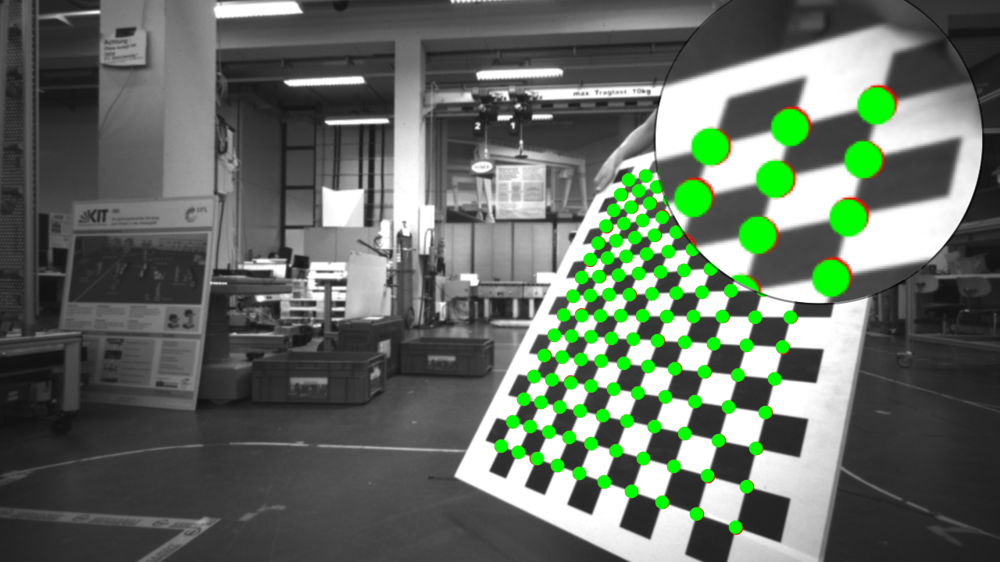

# Evaluate the accuracy of camera's calibration

There are different methods to evaluate the accuracy. Here we use the reprojection error to determine the accuracy. First, we use homography to calculate the camera's pose with a know chessboard. Then the corners on the chessboard are projected to the image. Next, we remove the distortion of the image with the calibration information. And the corners are detected in the image, which are corresponding to the corners on the chessboard. Finally, we calculate the Normalised Mean Square Error (NMSE) to determine the accuracy. If the output error value is small, then the calibration is good. Otherwise, we need to recalibrate the camera.

Our example:
<p float="left">
	
	
</p>

## Installation

### Linux Ubuntu 16.04

Install OpenCV, C++

A few updates to the instructions above were needed.

* libvtk needed to be updated to libvtk6-dev instead of (libvtk5-dev). The linker was having trouble locating libvtk5-dev while building, but this might not be a problem for everyone.

```bash
$> cd ~
$> git clone https://github.com/chengKID/Lidar_Obstacle_Detection.git
$> cd Evaluation_Calibration
$> mkdir build && cd build
$> cmake ..
$> make
$> ./calib_evaluation
```

## Input parameter
	./calib_evaluation   xxxx/    yyyy    zzzz_1   zzzz_2     wwww

	where xxxx/ stands for diractory of the camera.txt &&  (Note: do not forgette the "/")
		  yyyy stands for checkboad square size in meter
		  zzzz stands for the number of valid corners, e.g. for 15x10 zzzz_1 is 15 and zzzz_2 is 10
		  wwww stands for choosed an image, which has been calibrated

## Points
	Green points in image stand for reprojected points
	Blur points in image stand for corner points in rectified image